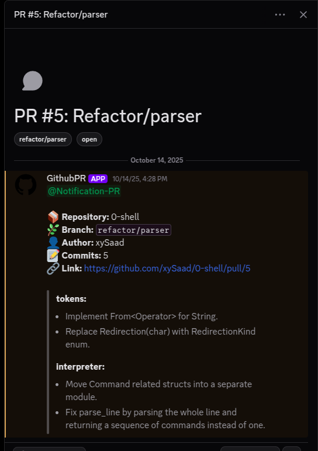

# Discord PR - Pull Request Notifier Bot

A Discord bot that sends notifications for opened pull requests.

## Usage

```bash
git clone https://github.com/xySaad/discord-pr
```

```bash
cd discord-pr
```

```bash
touch .env
```

fill the environement variables in .env file ([example](.example.env))

```bash
go mod tidy
```

```bash
go run main.go
```

## Features

#### - Opens a forum thread for every pull request


#### - Provides a simple overview message about the pull request



#### - Allows filtering using tags: `open` / `closed` or branch name


